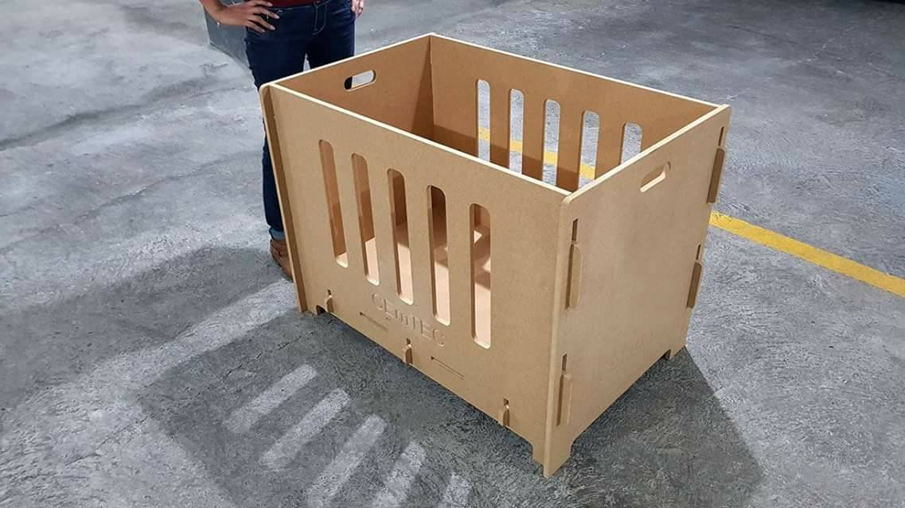

CEmTEC
======================

  

Open source woodworking crib for emergency situations
Work In progress

## About 

We are Paredes Aleman Architects a Guatemalan company how decided to help the people affected by the tragedy of the Fuego volcano. We thought about how we could support our country, even with a grain of sand. When observing the authorized shelters we saw that one of the problems that exist is the lack of suitable cradles for very small children who sadly were left homeless or who had to be evacuated. Immediately we started working on the design of that first space that a human being occupies, that could be manufactured quickly, that was easy to build, and that could also be effectively transportable.

## License

CEmTEC is licensed under the terms of the Creative Commons License Attribution-NonCommercial-ShareAlike 2.0 Generic (CC BY-NC-SA 2.0) license and is available for free.

